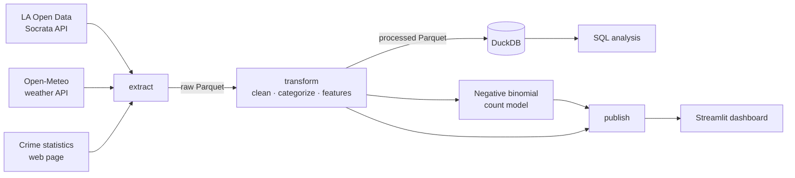

# Does Weather Move Crime in Los Angeles?

An end-to-end data pipeline and statistical analysis joining **1M+ LAPD crime records** with daily weather data to estimate how temperature and rain relate to crime, after controlling for season, weekday, and holidays.

**[Live dashboard →](https://<your-app>.streamlit.app)** · [Methodology](#methodology) · [Run it yourself](#run-it-yourself)

<!-- Replace with a GIF of the dashboard (record with a screen capture tool, keep under 5 MB) -->


## Key findings

<!-- Lead with the insight, not the tech. Fill in once the model has run. -->
- **[FINDING 1]** e.g. "Days above 90°F see X% more violent crime than 70–80°F days (95% CI: A–B%), holding month, weekday, and year constant."
- **[FINDING 2]** e.g. "Rain is associated with Y% fewer property crimes."
- **[FINDING 3]** e.g. "Raw correlations overstate the temperature effect by Z%, because hot days cluster in summer."


## Architecture



## Data

| Source | What | Access |
|---|---|---|
| [LAPD Crime Data 2020–Present](https://data.lacity.org/) | Incident-level records | Socrata API |
| [Open-Meteo Historical Archive](https://open-meteo.com/) | Daily temperature, rain, wind | REST API, no key |
| [SOURCE NAME] | [what you scraped] | Web scraping (BeautifulSoup) |

Details on endpoints, rate limits, and caching: [`docs/data_sources.md`](docs/data_sources.md). Data dictionary and cleaning decisions: [`data/README.md`](data/README.md).

## Methodology

1. **Clean**: deduplicate report numbers, parse mixed date formats, convert `(0, 0)` coordinates to missing, group ~140 crime descriptions into violent / property / vehicle / other.
2. **Build a daily panel**: crime counts per day and category (zero-count days included), joined to weather and calendar features.
3. **Model**: a negative binomial regression of daily counts on temperature bins and rain, with month, weekday, year, and holiday controls. Negative binomial rather than Poisson because counts are overdispersed. Results are incidence rate ratios relative to a dry 70–80°F day.

## Limitations

- One weather station represents the whole city; coastal and inland areas differ by 10°F+ on the same day.
- Reported crime ≠ actual crime. Reporting rates may themselves vary with weather.
- Associations only. Unobserved factors (events, policing changes) are not controlled for.
- [Add any data-quality issues you found, with numbers from `data/processed/quality_report.json`.]

## Run it yourself

```bash
git clone https://github.com/<your-username>/la-crime-weather.git
cd la-crime-weather
make install      # pip install -e ".[app,dev]"
make pipeline     # download, clean, model, publish (~X min)
make app          # open the dashboard locally
```

Run tests with `make test`. Configuration (date range, locations, bins) lives in [`config/settings.yaml`](config/settings.yaml).

## Project structure

```
src/crime_weather/   pipeline package: extract/ transform/ load/ analysis/ pipeline.py
sql/                 analysis queries run in DuckDB
notebooks/           narrative analysis; imports from src/, defines no logic
app/                 Streamlit dashboard + the small aggregated files it reads
tests/               pytest suite with offline fixtures (no network in CI)
docs/                data sources and architecture notes
```

## What I'd do next

- Use neighborhood-level weather (multiple stations) to exploit within-day geographic variation.
- [Your idea]

## About

Built by **Sara Armengol**, Industrial & Systems Engineering at Georgia Tech · [LinkedIn](https://linkedin.com/in/sara-armengol)

This project started as a CS 2316 (Data Input & Manipulation) assignment. Since then I have rewritten it as a tested, reproducible package; replaced the manual download with API extraction; added DuckDB/SQL analysis; replaced correlation analysis with a count-regression model with calendar controls; and built and deployed the dashboard.
