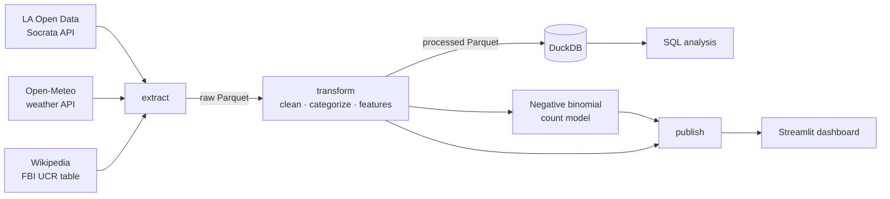

# Does Weather Move Crime in Los Angeles?

An end-to-end data pipeline and statistical analysis joining **~900K LAPD crime records (2020–2023)** with hourly weather data and FBI crime statistics, to estimate how temperature and rain relate to crime after controlling for season, weekday, and holidays.

**[Live dashboard →](https://<your-app>.streamlit.app)** · [Methodology](#methodology) · [Run it yourself](#run-it-yourself)

<!-- Replace with a GIF of the dashboard (record with a screen capture tool, keep under 5 MB) -->


## Key findings

<!-- Lead with the insight, not the tech. Fill in once the model has run. -->
- **[FINDING 1]** e.g. "Days above 90°F see X% more violent crime than 70–80°F days (95% CI: A–B%), holding month, weekday, and year constant."
- **[FINDING 2]** e.g. "Rain is associated with Y% fewer property crimes."
- **[FINDING 3]** e.g. "Weather alone explains almost none of the day-to-day variation (R² ≈ X); weekday and month explain far more."


## Architecture



## Data

| Source | What | Access |
|---|---|---|
| [LAPD Crime Data 2020–Present](https://data.lacity.org/) | Incident-level records | Socrata API |
| [Open-Meteo Historical Archive](https://open-meteo.com/) | Hourly temperature, precipitation, cloud cover, wind | REST API, no key |
| [Wikipedia: US cities by crime rate](https://en.wikipedia.org/wiki/List_of_United_States_cities_by_crime_rate) | FBI UCR rates per 100,000 for large cities | Web scraping (BeautifulSoup, pandas) |

Details on endpoints, rate limits, and caching: [`docs/data_sources.md`](docs/data_sources.md). Data dictionary and cleaning decisions: [`data/README.md`](data/README.md).

## Methodology

1. **Clean**: deduplicate report numbers, parse mixed date formats, convert `(0, 0)` coordinates to missing, and map ~140 crime descriptions to FBI UCR crime types (then to violent / property / other).
2. **Weather**: aggregate hourly observations to daily values and label each day (Rainy, Cloudy, Hot, Warm, Cool, Cold).
3. **Build a daily panel**: crime counts per day and category (zero-count days included), joined to weather and calendar features.
4. **Model**: a negative binomial regression of daily counts on temperature bins and rain, with month, weekday, year, and holiday controls, plus flags for first-of-month recording artifacts. Negative binomial rather than Poisson because counts are overdispersed. Results are incidence rate ratios relative to a dry 70–80°F day.
5. **Baselines and benchmarks**: a weather-only linear regression tested on later, unseen days, and LA's crime mix compared with other large California cities (population-weighted).

## Limitations

- One weather station represents the whole city; coastal and inland areas differ by 10°F+ on the same day.
- Reported crime ≠ actual crime. Reporting rates may themselves vary with weather.
- Data ends in 2023: LAPD changed records systems on March 7, 2024, so this dataset's 2024 counts are incomplete.
- The UCR benchmark year (stated on the Wikipedia page) differs from LA's 2020–2023 period.
- Associations only. Unobserved factors (events, policing changes) are not controlled for.
- [Add any data-quality issues you found, with numbers from `data/processed/quality_report.json`.]

## Run it yourself

```bash
git clone https://github.com/SaraArmengol/la-crime-weather.git
cd la-crime-weather
make install      # pip install -e ".[app,dev]"
make pipeline     # download, clean, model, publish (~X min)
make app          # open the dashboard locally
```

Run tests with `make test`. Configuration (date range, locations, bins) lives in [`config/settings.yaml`](config/settings.yaml).

## Project structure

```
src/crime_weather/   pipeline package: extract/ transform/ load/ analysis/ pipeline.py
sql/                 analysis queries run in DuckDB
notebooks/           narrative analysis; imports from src/, defines no logic
app/                 Streamlit dashboard + the small aggregated files it reads
tests/               pytest suite with offline fixtures (no network in CI)
docs/                data sources and architecture notes
```

## What I'd do next

- Use neighborhood-level weather (multiple stations) to exploit within-day geographic variation.
- [Your idea]

## About

Built by **Sara Armengol**, Industrial & Systems Engineering at Georgia Tech · [LinkedIn](https://linkedin.com/in/sara-armengol)

This project started as a CS 2316 (Data Input & Manipulation) group project with Joy Elkhoury. I rebuilt it as a tested, reproducible pipeline, corrected several analytical issues in the original, and added the statistical model and dashboard. **[What changed from the class version, and why →](docs/FROM_CLASS_PROJECT.md)**
